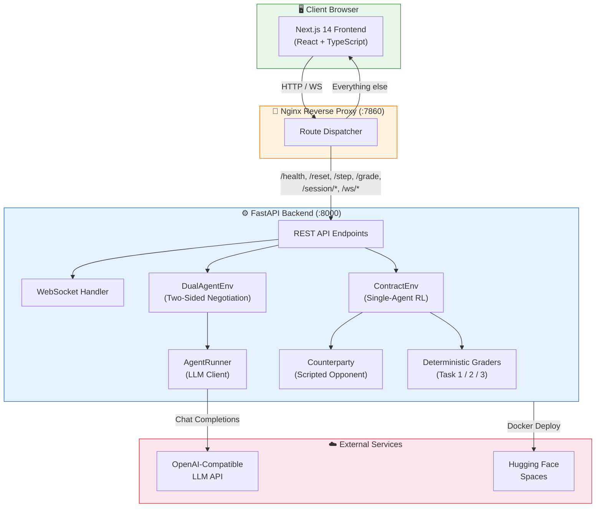
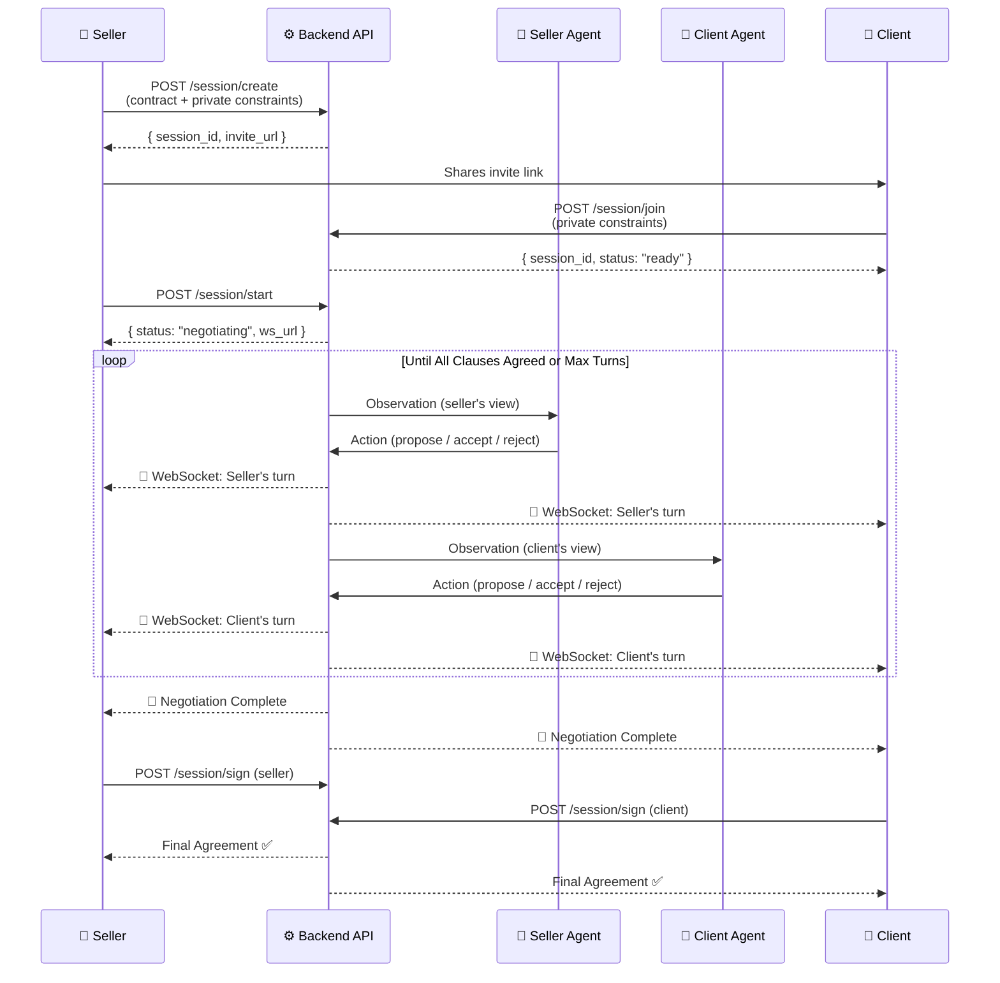
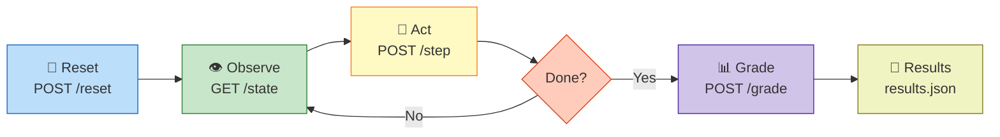

<div align="center">

# 📄 ContractEnv

### AI-Powered Contract Negotiation Environment

[](https://python.org)
[](https://nextjs.org)
[](https://fastapi.tiangolo.com)
[](https://docker.com)
[](LICENSE)
[](https://openenv.dev)

> A reinforcement learning environment and production-ready platform for autonomous AI contract negotiation — built for the **Meta/Scaler OpenEnv Hackathon 2026**.

[Live Demo](https://huggingface.co/spaces/contractenv) · [Report Bug](https://github.com/contractenv/issues) · [Request Feature](https://github.com/contractenv/issues)

### Demo & Learning Curve

<div style="display:flex; justify-content:center; gap:20px; flex-wrap:wrap;">
  
  
</div>

</div>

---

## 📑 Table of Contents

- [Overview](#-overview)
- [Key Features](#-key-features)
- [Architecture](#-architecture)
- [Tech Stack](#-tech-stack)
- [Project Structure](#-project-structure)
- [Getting Started](#-getting-started)
- [Usage](#-usage)
- [API Documentation](#-api-documentation)
- [OpenEnv Compliance](#-openenv-compliance)
- [Environment Tasks](#-environment-tasks)
- [Testing](#-testing)
- [Deployment](#-deployment)
- [Contributing](#-contributing)
- [License](#-license)

---

## 🧠 Overview

**ContractEnv** is a dual-purpose project that serves as both:

1. **An OpenEnv RL Environment** — Fully compliant with the [Meta/Scaler OpenEnv Hackathon 2026](https://openenv.dev) specification. It exposes a standard `reset() → step() → grade()` API with deterministic graders across three progressively harder tasks.

2. **A Real Two-Sided Negotiation Product** — A production-ready platform where two companies upload contracts, set **private constraints** (deal-breakers visible only to their own AI agent), and watch two LLM agents negotiate live via WebSocket streaming until a final executable agreement is reached.

### 🔑 The Key Innovation: Private Constraints

Unlike standard RL environments where all state is public, ContractEnv introduces **Private Constraints**. Each party defines secret rules (e.g., *"liability cap must not exceed $50k"*, *"non-compete limited to 12 months"*) that are known **only to their own AI agent**. This fundamentally changes the negotiation dynamics — agents must strategically probe their opponent's limits without revealing their own deal-breakers.

---

## ✨ Key Features

| Feature | Description |
|---|---|
| 🤖 **Dual-Agent Negotiation** | Two LLM agents negotiate autonomously, each guided by private constraints |
| 🔒 **Private Constraints** | Secret deal-breakers and rules hidden from the opposing party |
| 📡 **Real-Time WebSocket Streaming** | Watch negotiations unfold live, turn by turn |
| 📄 **Document Upload & Parsing** | Upload PDFs, DOCX, and TXT files — AI extracts key terms and summaries |
| 🏗️ **OpenEnv RL API** | Full `reset / step / state / grade` interface for RL agent training |
| 📊 **Deterministic Grading** | Reproducible scoring via keyword/logic-based graders (no LLM in grading) |
| 🎨 **Modern Next.js Frontend** | Polished UI with real-time negotiation viewer, session management, and signing flow |
| 🐳 **Dockerized Deployment** | Single-container deployment with Nginx reverse proxy to Hugging Face Spaces |
| 🔧 **MCP Tools** | Optional Model Context Protocol tools for legal reference lookups |
| 🔗 **Invite-Link Flow** | Seller creates a session → generates invite link → client joins with their own constraints |

---

## 🏗 Architecture

### System Architecture



### Negotiation Flow



### OpenEnv RL Loop



---

## 🛠 Tech Stack

### Backend
| Technology | Purpose |
|---|---|
| **Python 3.11** | Runtime |
| **FastAPI** | REST API + WebSocket server |
| **Pydantic v2** | Data validation and serialization |
| **OpenAI SDK** | LLM client for agent inference |
| **spaCy** | NLP for deterministic graders |
| **PyPDF2 / python-docx** | Document parsing (PDF, DOCX) |
| **uvicorn** | ASGI server |

### Frontend
| Technology | Purpose |
|---|---|
| **Next.js 14** | React framework (App Router) |
| **TypeScript** | Type-safe development |
| **Tailwind CSS 3** | Utility-first styling |
| **Recharts** | Data visualization |
| **Lucide React** | Icon library |
| **Axios** | HTTP client |

### Infrastructure
| Technology | Purpose |
|---|---|
| **Docker** | Containerization (multi-stage build) |
| **Nginx** | Reverse proxy and route dispatcher |
| **Hugging Face Spaces** | Cloud deployment |
| **Docker Compose** | Local multi-service orchestration |

---

## 📂 Project Structure

```
contractenv/
├── environment/                    # 🧠 Core RL Environment + Backend API
│   ├── main.py                     #    FastAPI application (all endpoints)
│   ├── env.py                      #    ContractEnv — single-agent RL environment
│   ├── dual_env.py                 #    DualAgentEnv — two-sided negotiation engine
│   ├── models.py                   #    Pydantic models (Clause, Action, Observation, etc.)
│   ├── counterparty.py             #    Scripted counterparty for deterministic tasks
│   ├── agent_runner.py             #    LLM-powered agent for dual negotiations
│   ├── contracts/                  #    Contract templates & loaders
│   │   └── nda_template.py         #    NDA template with 6 clauses per task
│   └── graders/                    #    Deterministic grading systems
│       ├── task1_grader.py         #    Clause Identification grader
│       ├── task2_grader.py         #    Clause Redlining grader
│       └── task3_grader.py         #    Full Negotiation grader
│
├── frontend/                       # 🎨 Next.js 14 Frontend
│   ├── src/
│   │   ├── app/                    #    Pages (App Router)
│   │   │   ├── page.tsx            #    Landing / Demo page
│   │   │   ├── demo/               #    Interactive environment demo
│   │   │   ├── join/               #    Client invite-link join flow
│   │   │   ├── negotiate/          #    Live negotiation viewer
│   │   │   └── session/            #    Session management
│   │   ├── components/             #    Reusable UI components
│   │   │   ├── NegotiatePanel.tsx   #    Real-time negotiation chat
│   │   │   ├── APIPanel.tsx         #    RL API interactive tester
│   │   │   ├── ScoresPanel.tsx      #    Scoring breakdown display
│   │   │   ├── HistoryPanel.tsx     #    Turn history viewer
│   │   │   ├── RewardSidebar.tsx    #    Live reward visualization
│   │   │   ├── GradeModal.tsx       #    Grading results modal
│   │   │   └── Sidebar.tsx          #    App navigation sidebar
│   │   ├── hooks/                  #    Custom React hooks
│   │   ├── lib/                    #    Utility functions
│   │   └── types/                  #    TypeScript type definitions
│   ├── tailwind.config.ts          #    Tailwind theme configuration
│   └── package.json                #    Frontend dependencies
│
├── mcp_tools/                      # 🔧 Model Context Protocol Tools
│   └── legal_tools.py              #    Legal reference lookup tools
│
├── server/                         # 🚀 OpenEnv Server Entry Point
│   └── app.py                      #    Server bootstrap
│
├── tests/                          # 🧪 Test Suite
│   ├── test_api.py                 #    API endpoint tests
│   └── test_graders.py             #    Grader unit tests
│
├── inference.py                    # 🤖 Baseline inference script
├── openenv.yaml                    # 📋 OpenEnv environment specification
├── requirements.txt                # 📦 Python dependencies
├── pyproject.toml                  # 📦 Project metadata
├── Dockerfile                      # 🐳 Combined Docker build (prod)
├── docker-compose.yml              # 🐳 Local development compose
├── nginx.conf                      # 🔀 Nginx reverse proxy config
├── start.sh                        # 🚀 Container startup script
├── .env.example                    # 🔐 Environment variable template
└── README.md                       # 📖 This file
```

---

## 🚀 Getting Started

### Prerequisites

- **Python** ≥ 3.11
- **Node.js** ≥ 18
- **npm** ≥ 9
- **Docker** (optional, for containerized deployment)
- An **OpenAI-compatible API key** (e.g., OpenAI, together.ai, local LLM)

### 1. Clone the Repository

```bash
git clone https://github.com/your-username/contractenv.git
cd contractenv
```

### 2. Set Up Environment Variables

```bash
cp .env.example .env
```

Edit `.env` with your credentials:

```env
# LLM API Configuration
API_KEY=your_openai_or_proxy_key
API_BASE_URL=https://api.openai.com/v1
MODEL_NAME=gpt-4o-mini

# Optional Hugging Face token for deployment
HF_TOKEN=hf_...

# Session security (optional)
SESSION_SECRET=super_secret_string
```

### 3. Install & Run — Backend

```bash
python -m venv .venv
source .venv/bin/activate   # Windows: .venv\Scripts\activate
pip install -r requirements.txt

# Start the API server
uvicorn environment.main:app --host 0.0.0.0 --port 7860 --reload
```

### 4. Install & Run — Frontend

```bash
cd frontend
npm install
npm run dev
```

The frontend runs at **http://localhost:3000** and the backend API at **http://localhost:7860**.

### 5. Docker (Recommended for Production)

```bash
# Build and run the combined container
docker build -t contractenv .
docker run -p 7860:7860 --env-file .env contractenv

# Or use Docker Compose for local development
docker compose up --build
```

---

## 💡 Usage

### As an RL Environment (OpenEnv Mode)

Run the baseline inference script against the three tasks:

```bash
python inference.py
```

This will:
1. Connect to the environment at `http://localhost:7860`
2. Run all three tasks (`task1`, `task2`, `task3`) sequentially
3. Use the configured LLM for agent actions with deterministic fallbacks
4. Output step-by-step results and save final scores to `results.json`

**Sample Output:**
```
[START] task=task1
[STEP] step=1 reward=0.1500
[STEP] step=2 reward=0.1500
...
[END] task=task1 score=0.9200 steps=6 passed=true duration=4.2100
```

### As a Negotiation Product

1. **Seller** opens the app and creates a new negotiation session
2. **Seller** uploads their contract and sets private constraints
3. **Seller** shares the generated invite link with the client
4. **Client** opens the invite link, sets their own private constraints
5. Both parties hit **"Start Negotiation"**
6. **Two AI agents** negotiate live — watch the conversation in real-time via WebSocket
7. Once all clauses are agreed, both parties **sign** the final contract

---

## 📡 API Documentation

### OpenEnv Standard Endpoints

| Method | Endpoint | Description |
|--------|----------|-------------|
| `GET` | `/health` | Health check — returns status, version, active sessions |
| `POST` | `/reset` | Reset environment — start a new episode |
| `POST` | `/step` | Submit an action — receive observation + reward |
| `GET` | `/state` | Get current environment state |
| `GET` | `/tasks` | List available tasks with metadata |
| `POST` | `/grade` | Grade a completed episode |

### Session / Product Endpoints

| Method | Endpoint | Description |
|--------|----------|-------------|
| `POST` | `/session/create` | Create a new negotiation session (seller) |
| `POST` | `/session/join` | Join a session via invite token (client) |
| `POST` | `/session/start` | Begin the live AI negotiation |
| `GET` | `/session/status` | Get session status, history, config |
| `POST` | `/session/sign` | Sign the final agreement |
| `GET` | `/session/contract` | Retrieve the final contract text |
| `POST` | `/session/link-documents` | Link uploaded documents to a session |
| `WS` | `/ws/{session_id}` | WebSocket stream of negotiation turns |

### Document Endpoints

| Method | Endpoint | Description |
|--------|----------|-------------|
| `POST` | `/document/upload` | Upload PDF / DOCX / TXT — returns AI summary + key terms |
| `GET` | `/session/documents` | List documents linked to a session |

### Example: Running a Full RL Episode

```bash
# 1. Reset the environment
curl -X POST http://localhost:7860/reset \
  -H "Content-Type: application/json" \
  -d '{"task_id": "task1"}'

# Response:
# {
#   "session_id": "abc-123",
#   "observation": { "clauses": [...], "turn": 0, "max_turns": 20, ... }
# }

# 2. Take an action
curl -X POST http://localhost:7860/step \
  -H "Content-Type: application/json" \
  -d '{
    "session_id": "abc-123",
    "action": {
      "clause_id": "c1",
      "action_type": "flag",
      "label": "unfair",
      "reason": "Overly broad confidentiality scope"
    }
  }'

# 3. Grade the episode
curl -X POST http://localhost:7860/grade \
  -H "Content-Type: application/json" \
  -d '{"session_id": "abc-123", "task_id": "task1"}'

# Response:
# { "score": 0.92, "passed": true, "details": [...] }
```

### Example: Creating a Two-Sided Negotiation

```bash
# 1. Seller creates session
curl -X POST http://localhost:7860/session/create \
  -H "Content-Type: application/json" \
  -d '{
    "seller_company_name": "Acme Corp",
    "seller_constraints": [
      {
        "constraint_id": "s1",
        "description": "Non-compete must not exceed 12 months",
        "clause_category": "scope",
        "is_deal_breaker": true,
        "rule_type": "max_value",
        "rule_value": "12 months"
      }
    ],
    "seller_agent_style": "balanced"
  }'

# Response includes invite_url for the client

# 2. Client joins with their own constraints
curl -X POST http://localhost:7860/session/join \
  -H "Content-Type: application/json" \
  -d '{
    "invite_token": "abc123xyz",
    "client_company_name": "Beta Inc",
    "client_constraints": [...],
    "client_agent_style": "cooperative"
  }'

# 3. Start the negotiation
curl -X POST http://localhost:7860/session/start \
  -H "Content-Type: application/json" \
  -d '{"session_id": "..."}'
```

---

## ✅ OpenEnv Compliance

ContractEnv is fully compliant with the [OpenEnv specification](https://openenv.dev):

| Requirement | Status | Details |
|---|---|---|
| `POST /reset` | ✅ | Returns observation + session_id |
| `POST /step` | ✅ | Returns observation, reward ∈ [-1, 1], done flag |
| `GET /state` | ✅ | Returns current observation |
| `GET /tasks` | ✅ | Lists 3 tasks with metadata |
| `POST /grade` | ✅ | Deterministic scoring per task |
| `GET /health` | ✅ | Health check with version |
| Deterministic grading | ✅ | No LLM in grading path — keyword + logic only |
| Baseline inference script | ✅ | `inference.py` with LLM + fallback |
| Docker deployment | ✅ | Multi-stage Dockerfile |
| `openenv.yaml` | ✅ | Full environment specification |

---

## 🎯 Environment Tasks

### Task 1: Clause Identification (Easy)

| Property | Value |
|---|---|
| **Goal** | Identify which of 6 NDA clauses are fair, unfair, or neutral |
| **Action** | `flag` with `label` (fair/unfair/neutral) and `reason` |
| **Max Turns** | 20 |
| **Target Score** | 0.85 |
| **Grading** | Label accuracy (50%) + reason quality (25%) + deal-breaker detection (25%) − false positive penalty |

### Task 2: Clause Redlining (Medium)

| Property | Value |
|---|---|
| **Goal** | Propose improved replacement text for unfair clauses |
| **Action** | `propose` with `proposed_text` |
| **Max Turns** | 30 |
| **Target Score** | 0.65 |
| **Grading** | Keyword-based quality scoring (time limits, specificity, carve-outs) |

### Task 3: Full Negotiation (Hard)

| Property | Value |
|---|---|
| **Goal** | Negotiate multi-turn with a scripted counterparty to reach agreement |
| **Action** | `propose` / `accept` / `reject` / `counter` |
| **Max Turns** | 50 |
| **Target Score** | 0.45 |
| **Grading** | Agreement ratio (clauses agreed / total) + reward accumulation |

---

## 🧪 Testing

```bash
# Run all tests
pytest tests/ -v

# Run specific test files
pytest tests/test_api.py -v      # API endpoint tests
pytest tests/test_graders.py -v  # Grader unit tests

# Run with async support
pytest tests/ -v --asyncio-mode=auto
```

---

## 🚢 Deployment

### Hugging Face Spaces

The project is configured for deployment to [Hugging Face Spaces](https://huggingface.co/spaces) via Docker:

```bash
# Push to Hugging Face
git remote add hf https://huggingface.co/spaces/YOUR_USERNAME/contractenv
git push hf main
```

The combined `Dockerfile` builds both the frontend and backend into a single container:
- **Nginx** listens on port `7860` (Hugging Face's default)
- API endpoints are routed to the FastAPI backend on `:8000`
- All other requests are proxied to Next.js on `:3000`

### Render

A `render.yaml` blueprint is included for one-click deployment to [Render](https://render.com).

---

## 🤝 Contributing

Contributions are welcome! Here's how you can help:

### Getting Started

1. **Fork** the repository
2. **Create** a feature branch: `git checkout -b feature/amazing-feature`
3. **Commit** your changes: `git commit -m 'feat: add amazing feature'`
4. **Push** to the branch: `git push origin feature/amazing-feature`
5. **Open** a Pull Request

### Development Guidelines

- **Backend**: Follow PEP 8, use type hints, and add Pydantic models for all API schemas
- **Frontend**: Use TypeScript strict mode, follow the existing component patterns
- **Tests**: Add tests for new graders and API endpoints — grading must remain **deterministic**
- **Commits**: Follow [Conventional Commits](https://www.conventionalcommits.org/) (`feat:`, `fix:`, `docs:`, etc.)

### Areas for Contribution

- 🌐 New contract templates beyond NDA (MSA, SaaS, Employment)
- 🧠 Improved grading algorithms with semantic similarity
- 🎨 Frontend polish and accessibility improvements
- 📄 Additional document parsers (XLSX, CSV)
- 🔧 More MCP tools for legal research
- 🧪 Expanded test coverage

---

## 📄 License

This project is licensed under the **MIT License** — see the [LICENSE](LICENSE) file for details.

---

## 🙏 Acknowledgments

- [Meta & Scaler](https://openenv.dev) — for the OpenEnv Hackathon 2026 framework
- [OpenAI](https://openai.com) — for the LLM API powering agent inference
- [FastAPI](https://fastapi.tiangolo.com) — for the high-performance Python API framework
- [Next.js](https://nextjs.org) — for the React framework driving the frontend

---

<div align="center">

**Built with ❤️ for the Meta/Scaler OpenEnv Hackathon 2026**

[⬆ Back to Top](#-contractenv)

</div>